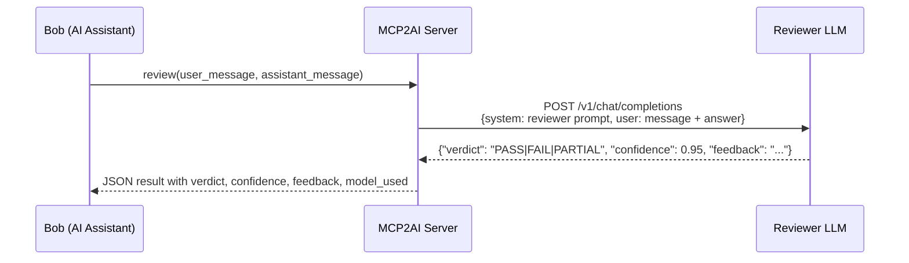

# MCP2AI

A Java 21 MCP (Model Context Protocol) server that exposes a `review` tool - it submits an AI assistant's answer to a second, independent LLM for validation and structured feedback. The reviewer runs on a different model from the primary assistant, giving genuinely independent coverage of correctness, completeness, and clarity.

Built with the [Java MCP SDK](https://github.com/modelcontextprotocol/java-sdk) and the official [OpenAI Java SDK](https://github.com/openai/openai-java). Works against both OpenAI cloud and any OpenAI-compatible local server (Ollama, LM Studio, …).

---

## How It Works



The server exposes a single MCP tool over **Streamable HTTP** (MCP Spec 2025-03-26) on `http://127.0.0.1:8081/mcp`. It binds strictly to the loopback interface and is never exposed to the network.

> **💡 Best Practice for AI Assistants (Skills / Instructions):**
> Rather than manually instructing the AI assistant in every user prompt to perform a review (which pollutes the input sent to the reviewer LLM), Bob or any AI assistant supporting skills/custom instructions should be configured with a dedicated skill or workflow instruction (such as the included [Bob Skill: `/mcp-review`](#bob-skill-mcp-review)). This allows the assistant to keep user queries clean, draft the answer independently, submit both to the `review` tool, and present the final validated result automatically.

---

## Bob Skill: `/mcp-review`

A pre-configured Bob skill is available in `.bob/skills/mcp-review/` to automate requesting reviews with the `mcp-to-ai` MCP server.

When activated, Bob drafts an answer to your question, automatically sends both your original prompt and the draft answer to the secondary reviewer LLM using the `review` tool, and outputs the final response together with a structured review breakdown (`PASS`, `PARTIAL`, or `FAIL`, confidence score, reviewer model, and feedback).

### How to Use the Skill (Step-by-Step for Novice Users)

You can activate the review workflow in a new chat conversation using either of these simple methods:

#### Method 1: Using the Slash Command (Recommended)
Prefix your prompt with `/mcp-review`:

```text
/mcp-review Tell me a joke about Chuck Norris.
```
```text
/mcp-review How do I configure SSL in Spring Boot?
```

#### Method 2: Natural Language Phrases
Include phrases like **"with review"**, **"(with review)"**, **"with a second opinion"**, or **"in review mode"** anywhere in your prompt:

```text
Tell me a joke about Chuck Norris (with review)
```
```text
Explain how Java virtual threads work under the hood with a second opinion.
```

### Example Output

When you ask a question using `/mcp-review`, the output looks like:

> When Alexander Graham Bell invented the telephone, he had three missed calls from Chuck Norris.
>
> ---
>
> ### Secondary LLM Review
> - **Verdict:** `PASS`
> - **Confidence:** `0.95`
> - **Model Used:** `llama3.2:3b`
> - **Feedback:**
>   > The response provides a humorous, classic Chuck Norris fact adhering to the prompt requirements.

### Real-World Usage Examples

The following documents trace a complete review session end-to-end - user prompt, assistant draft, raw tool call and JSON response, the reviewer's verdict and feedback, and the final revised answer delivered to the user. They are a useful reference for understanding exactly what happens at each step of the review workflow.

| Document | Reviewer Model | Verdict | What it demonstrates |
|---|---|---|---|
| [📄 Primes - reviewed by `llama3.2:3b` (local)](doc/Primes.Llama.Reviewed.md) | `llama3.2:3b` via Ollama | `PASS` | A fast-path review: the draft is accepted with only minor clarity suggestions; the final answer is delivered with a light touch. |
| [📄 Primes - reviewed by `gpt-5.6-sol` (OpenAI)](doc/Primes.GPT-5.6-Sol.Reviewed.md) | `gpt-5.6-sol` via OpenAI | `PARTIAL` | A revision-cycle review: a more powerful model catches real correctness issues (overflow bugs, misleading memory claims, unimplemented optimisations), triggering a full rewrite before delivery. |

---

## MCP Tool: `review`

> **Note on Tool Namespacing (`mcp__<server>__<tool>`):**
> In Bob and compatible MCP client environments, external MCP tools are registered using namespaced identifiers formatted as `mcp__<server-name>__<tool-name>` (e.g., `mcp__mcp-to-ai__review`). If you ever need to instruct the assistant directly without using the `/mcp-review` skill, you can refer to the tool by its full ID `mcp__mcp-to-ai__review` or simply ask to use the `review` tool from the `mcp-to-ai` server.

| Field | Type | Required | Description |
|---|---|---|---|
| `user_message` | string | ✅ | The original question the user asked the AI assistant |
| `assistant_message` | string | ✅ | The AI assistant's answer to be reviewed |
| `temperature` | number | ❌ | Override the reviewer LLM temperature (0.0–1.0); falls back to `OPENAI_TEMPERATURE` |

**Response** - a JSON object with four fields:

| Field | Type | Description |
|---|---|---|
| `verdict` | string | `PASS`, `FAIL`, or `PARTIAL` |
| `confidence` | number | Reviewer's self-assessed certainty (0.0–1.0) |
| `feedback` | string | Explanation of what is correct, wrong, missing, or improvable |
| `model_used` | string | The model that produced the review (traceability) |

---

## Prerequisites

- **Java 21** - [download](https://adoptium.net/temurin/releases/?version=21) or install via your package manager
- **Maven 3.9+** - [download](https://maven.apache.org/download.cgi)

> On this machine, Java and Maven can be added to the `PATH` for the current session by running:
> ```cmd
> D:\Development\SetupEnvJava21.cmd
> D:\Development\SetupEnvMaven.cmd
> ```
> These are local convenience scripts - they are not required on other machines where Java 21 and Maven are already on the `PATH`.

---

## Build

```cmd
mvn clean source:jar install
```

The uber-jar is produced at `target/MCP2AI-1.0.0.jar`. It contains all dependencies and is self-contained.

---

## Configuration

Copy one of the ready-made templates to `src/main/resources/config.properties`:

| Template | Provider | Copy command |
|---|---|---|
| `config.properties.openai` | OpenAI cloud | `copy src\main\resources\config.properties.openai src\main\resources\config.properties` |
| `config.properties.ollama` | Ollama (local) | `copy src\main\resources\config.properties.ollama src\main\resources\config.properties` |
| `config.properties.lmstudio` | LM Studio (local) | `copy src\main\resources\config.properties.lmstudio src\main\resources\config.properties` |
| `config.properties.example` | Generic template | `copy src\main\resources\config.properties.example src\main\resources\config.properties` |

> `config.properties` is gitignored and will never be committed. All templates are in `src/main/resources/`.

### Configuration keys

| Key | Default | Description |
|---|---|---|
| `OPENAI_BASE_URL` | `https://api.openai.com/v1` | Endpoint URL of the reviewer LLM |
| `OPENAI_API_KEY` | *(none)* | API key - any non-empty string works for local servers |
| `OPENAI_MODEL` | `gpt-4o-mini` | Model used for the `review` tool |
| `OPENAI_TEMPERATURE` | `0.01` | Temperature for review calls (use `0.01` for local models that handle exact `0.0` poorly) |
| `OPENAI_TIMEOUT` | `120` | Request timeout in seconds (2 minutes); increase for slow local models |

### Resolution order

Settings are resolved in this order - the first non-empty value wins:

1. **Java system property** - `-Dkey=value` on the command line
2. **OS environment variable** - `set KEY=value` (cmd) / `$env:KEY=value` (PowerShell)
3. **`config.properties`** - file on the classpath
4. **Hard-coded default** - built-in fallback

---

## Running

### Check configuration and list available models

```cmd
java -jar target\MCP2AI-1.0.0.jar config
```

Prints all resolved configuration values (API key masked) and queries the configured endpoint for available models. Run this first to verify your setup before starting the server.

### Start the MCP server

```cmd
java -jar target\MCP2AI-1.0.0.jar streamableserver
```

The server starts on `http://127.0.0.1:8081/mcp` and blocks the terminal. Connect your MCP client to that endpoint.

### Override settings inline (no config.properties edit needed)

Using Java system properties:

Using a local Ollama model:

```cmd
java -DOPENAI_BASE_URL=http://localhost:11434/v1 -DOPENAI_MODEL=llama3.2:3b -DOPENAI_API_KEY=local -jar target\MCP2AI-1.0.0.jar streamableserver
```

Using a large, powerful OpenAI cloud model:

```cmd
java -DOPENAI_BASE_URL=https://api.openai.com/v1 -DOPENAI_MODEL=gpt-5.6-sol -DOPENAI_API_KEY=sk-... -DOPENAI_TEMPERATURE=1 -jar target\MCP2AI-1.0.0.jar streamableserver
```

Using environment variables:

**Windows (cmd):**
```cmd
set OPENAI_BASE_URL=http://localhost:11434/v1
set OPENAI_API_KEY=local
set OPENAI_MODEL=llama3.2:3b
java -jar target\MCP2AI-1.0.0.jar streamableserver
```

**Windows (PowerShell):**
```powershell
$env:OPENAI_BASE_URL = "http://localhost:11434/v1"
$env:OPENAI_API_KEY  = "local"
$env:OPENAI_MODEL    = "llama3.2:3b"
java -jar target\MCP2AI-1.0.0.jar streamableserver
```

**Linux / macOS:**
```bash
export OPENAI_BASE_URL=http://localhost:11434/v1
export OPENAI_API_KEY=local
export OPENAI_MODEL=llama3.2:3b
java -jar target/MCP2AI-1.0.0.jar streamableserver
```

> `set` / `$env:` / `export` are session-scoped - variables are only active for the current terminal window.

---

## Local Server Setup

Any OpenAI-compatible local server works.

| Server | Default base URL | Config template |
|---|---|---|
| [Ollama](https://ollama.com) | `http://localhost:11434/v1` | `config.properties.ollama` |
| [LM Studio](https://lmstudio.ai) | `http://localhost:1234/v1` | `config.properties.lmstudio` |

**Ollama quick-start:**

```cmd
ollama pull llama3.2:3b
copy src\main\resources\config.properties.ollama src\main\resources\config.properties
mvn clean package
java -jar target\MCP2AI-1.0.0.jar streamableserver
```

**LM Studio quick-start:**

1. Download from [lmstudio.ai](https://lmstudio.ai) and load a model
2. Start the local server (default port 1234)
3. Copy the template and set the model name:
   ```cmd
   copy src\main\resources\config.properties.lmstudio src\main\resources\config.properties
   ```
4. Edit `config.properties` and set `OPENAI_MODEL` to the model name shown in LM Studio

---

## Cloud Provider Setup

### OpenAI

```cmd
copy src\main\resources\config.properties.openai src\main\resources\config.properties
```

Edit `config.properties` and replace `sk-...` with your real API key from [platform.openai.com/api-keys](https://platform.openai.com/api-keys). Recommended reviewer model: `gpt-4o-mini`.

### Other OpenAI-compatible providers

Any provider that exposes an OpenAI-compatible REST API works - point `OPENAI_BASE_URL` at their endpoint and set `OPENAI_API_KEY`.

| Provider | Base URL |
|---|---|
| [Azure OpenAI](https://azure.microsoft.com/en-us/products/ai-services/openai-service) | `https://<resource>.openai.azure.com/openai/deployments/<deployment>` |
| [Groq](https://console.groq.com) | `https://api.groq.com/openai/v1` |
| [Together AI](https://www.together.ai) | `https://api.together.xyz/v1` |
| [Mistral AI](https://console.mistral.ai) | `https://api.mistral.ai/v1` |
| [OpenRouter](https://openrouter.ai) | `https://openrouter.ai/api/v1` |

---

## Project Structure

```
src/main/java/edu/java/
├── MCP2AI.java                          # Entry point and command dispatcher
├── api/
│   ├── Config.java                      # Config loader (system property → env var → config.properties → default)
│   ├── ClientFactory.java               # Builds the OpenAIClient with timeout
│   ├── OpenAIChat.java                  # LLM review call + JSON response parsing
│   └── ReviewVerdict.java               # Enum: PASS | FAIL | PARTIAL
├── service/
│   ├── Server.java                      # Abstract base: MCP tool factory methods
│   └── StreamableSseServer.java         # Streamable HTTP transport (MCP Spec 2025-03-26)
└── util/
    ├── ModelsDiscovery.java             # Lists available models with inferred capability tags
    └── SchemaBuilder.java               # JSON Schema builder for MCP tool input schemas

src/main/resources/
├── log4j2.xml                           # Logging configuration
├── config.properties                    # Active config (gitignored)
├── config.properties.example            # Generic configuration template
├── config.properties.openai             # Ready-to-use OpenAI cloud template
├── config.properties.ollama             # Ready-to-use Ollama local template
└── config.properties.lmstudio          # Ready-to-use LM Studio local template
```

---

## Dependencies

| Artifact | Version | Purpose |
|---|---|---|
| [`io.modelcontextprotocol.sdk:mcp`](https://github.com/modelcontextprotocol/java-sdk) | 2.0.1 | MCP Java SDK core |
| [`io.modelcontextprotocol.sdk:mcp-spring-webflux`](https://github.com/modelcontextprotocol/java-sdk) | 0.18.4 | Streamable HTTP transport via Spring WebFlux |
| [`com.openai:openai-java`](https://github.com/openai/openai-java) | 4.52.0 | Official OpenAI Java SDK |
| [`io.projectreactor.netty:reactor-netty-http`](https://projectreactor.io/docs/netty/release/reference/) | 1.3.6 | Reactor Netty HTTP server |
| [`org.springframework:spring-context`](https://docs.spring.io/spring-framework/docs/current/reference/html/) | 6.2.1 | Spring context for WebFlux routing |
| [`com.fasterxml.jackson.core:jackson-databind`](https://github.com/FasterXML/jackson-databind) | 2.22.2 | JSON serialization and LLM response parsing |
| [`org.apache.logging.log4j:log4j-core`](https://logging.apache.org/log4j/2.x/) | 2.26.1 | Logging implementation |
| [`org.apache.logging.log4j:log4j-slf4j2-impl`](https://logging.apache.org/log4j/2.x/) | 2.26.1 | SLF4J bridge for SDK internals |
