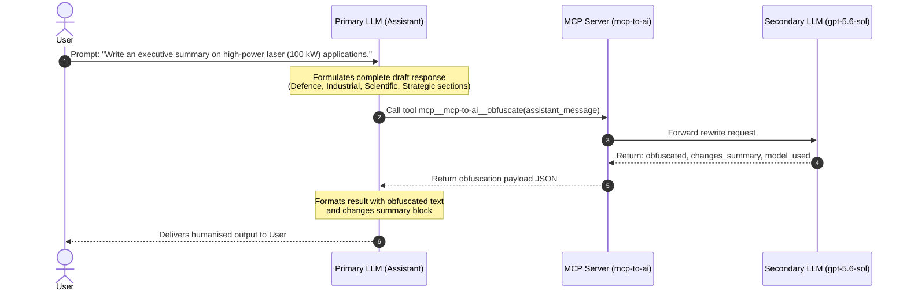

# Obfuscation Process Documentation: High-Power Laser Executive Summary

This document details the end-to-end execution of a dual-LLM obfuscation task using the **MCP2AI** Model Context Protocol (MCP) server. It illustrates how an AI assistant's draft response is submitted to an independent secondary rewriting LLM (`gpt-5.6-sol`) via the `mcp-to-ai` MCP server and how the final humanised output is assembled.

---

## Overview of the Obfuscation Architecture

The MCP2AI architecture allows an AI Assistant (Primary LLM) to draft responses and pass them through an independent secondary LLM (Obfuscator LLM) before returning the final result to the user. The obfuscation pipeline rewrites the text to defeat statistical AI-content detectors by attacking their three scoring signals: token perplexity, sentence burstiness, and vocabulary fingerprinting.



---

## 1. User Input

The user initiated the request with the following query:

```text
Write a executive summary what the use of high-powered Lasers (e.g. 100kW) is against drones.
```

---

## 2. Assistant Draft Message

Before passing the text to the obfuscation tool, the assistant formulated the draft, see left panel in section 4, covering the four main domains of 100 kW-class laser application.

---

## 3. Obfuscation Tool Call & Output

The assistant invoked the tool `mcp__mcp-to-ai__obfuscate` with the complete draft text.

### Tool Invocation Payload

```json
{
  "assistant_message": "<Assistant Draft Message Content>"
}
```

### Tool Response from Secondary LLM (`gpt-5.6-sol`)

```json
{
  "verdict": "PASS",
  "confidence": 0.99,
  "obfuscated": "<Obfuscated text - see Section 5>",
  "changes_summary": "Reworked the prose for a more natural cadence, varied sentence length, favored active constructions, and replaced stock phrasing while retaining every factual claim, figure, qualification, heading, and list item.",
  "model_used": "gpt-5.6-sol"
}
```

---

## 4. Side-by-Side Comparison (Before Obfuscation vs. After Obfuscation)

The following side-by-side comparison shows the specific changes the secondary LLM applied to defeat AI-content detector signals.

### What the obfuscator changed

<table>
<tr>
<th width="50%">🔴 Before Obfuscation (Assistant Draft)</th>
<th width="50%">🟢 After Obfuscation (Humanised & Finalised)</th>
</tr>
<tr>
<td valign="top">

```text
## Executive Summary: High-Power Laser Weapons for Counter-Drone Operations

High-power laser systems operating at power levels of 100 kW and above represent a transformative and cost-effective solution for neutralizing unmanned aerial vehicle (UAV) threats across military, critical infrastructure, and border security domains.

**Mechanism of Effect**

High-energy lasers (HELs) defeat drones through directed thermal energy. At 100 kW, a focused beam can heat and structurally compromise a drone's airframe, electronics, or propulsion system within seconds of dwell time-sufficient to disable or destroy most commercial and military-grade UAVs at ranges of 1–5 km. The speed-of-light delivery eliminates the lead-time calculation required for kinetic interceptors.

**Key Advantages**

- **Cost per engagement**: A laser "shot" costs approximately $1–$5 in electricity, compared to $10,000–$500,000 for conventional missiles or interceptor rounds, making it economically viable against drone swarms.
- **Deep magazine depth**: As long as the power supply operates, the system can engage continuously-critical against saturation attacks involving dozens or hundreds of drones simultaneously.
- **Precision and collateral risk**: The beam can be precisely modulated to disable rather than destroy, reducing fragmentation and collateral damage in populated or sensitive areas.
- **Silent operation**: No acoustic signature during firing, which is operationally significant for position concealment.

**Operational Limitations**

Atmospheric conditions present the most significant constraint. Fog, rain, dust, and smoke scatter and absorb the beam, degrading effective range and dwell efficiency-sometimes by 40–80% under adverse weather. Beam quality also degrades with thermal blooming at extended ranges. Additionally, reflective or ablative drone coatings can partially mitigate thermal effects, though these countermeasures add weight and complexity to adversary systems.

Power generation and thermal management remain engineering challenges for mobile or shipborne platforms. A 100 kW continuous-wave laser requires substantial electrical infrastructure and cooling, which constrains integration into smaller ground vehicles or aircraft.

**Current Deployment Landscape**

Systems such as the US Army's 100 kW High Energy Laser Mobile Demonstrator (HEL MD), Raytheon's High Energy Laser weapon system (HEL WS), and Israel's Iron Beam (100 kW class) have demonstrated operational engagement of drones, mortars, and rockets in field trials. The UK's DragonFire program, targeting comparable power levels, achieved first successful drone kills in 2024 trials.

**Strategic Assessment**

High-power laser weapons are not a universal replacement for kinetic air defense-they function most effectively as a complementary layer in a multi-tier system. Against small, low-altitude drone threats-particularly swarms of commercial-off-the-shelf UAVs where kinetic interceptors are cost-prohibitive-100 kW-class lasers offer the most economically and operationally sustainable solution currently available. Continued investment in beam quality, power density, and all-weather resilience will determine how rapidly these systems displace legacy counter-UAS methods.
```

</td>
<td valign="top">

```text
## Executive Summary: High-Power Laser Weapons for Counter-Drone Operations

High-power laser systems rated at 100 kW and above offer a major, cost-effective means of neutralizing unmanned aerial vehicle (UAV) threats in military operations, at critical infrastructure sites, and along borders.

**Mechanism of Effect**

High-energy lasers (HELs) defeat drones by directing thermal energy at them. At 100 kW, a focused beam can heat and structurally compromise a drone's airframe, electronics, or propulsion system within seconds of dwell time. That is enough to disable or destroy most commercial and military-grade UAVs at ranges of 1–5 km. Because the beam travels at the speed of light, operators do not need the lead-time calculations required for kinetic interceptors.

**Key Advantages**

- **Cost per engagement**: A laser "shot" costs approximately $1–$5 in electricity. Conventional missiles or interceptor rounds cost $10,000–$500,000, so lasers are economically viable against drone swarms.
- **Deep magazine depth**: The system can keep engaging targets as long as its power supply operates. This capacity matters during saturation attacks involving dozens or hundreds of drones simultaneously.
- **Precision and collateral risk**: Operators can precisely modulate the beam to disable a drone rather than destroy it, reducing fragmentation and collateral damage in populated or sensitive areas.
- **Silent operation**: Firing produces no acoustic signature, which helps conceal the system's position.

**Operational Limitations**

Atmospheric conditions are the main constraint. Fog, rain, dust, and smoke scatter and absorb the beam, reducing effective range and dwell efficiency-sometimes by 40–80% in adverse weather. Thermal blooming also degrades beam quality at extended ranges. Reflective or ablative drone coatings can partly reduce thermal effects, although these countermeasures add weight and complexity to adversary systems.

Power generation and thermal management remain engineering challenges on mobile or shipborne platforms. A 100 kW continuous-wave laser needs substantial electrical infrastructure and cooling, limiting its integration into smaller ground vehicles or aircraft.

**Current Deployment Landscape**

The US Army's 100 kW High Energy Laser Mobile Demonstrator (HEL MD), Raytheon's High Energy Laser weapon system (HEL WS), and Israel's Iron Beam (100 kW class) have demonstrated operational engagement of drones, mortars, and rockets in field trials. The UK's DragonFire program targets comparable power levels and achieved its first successful drone kills in 2024 trials.

**Strategic Assessment**

High-power laser weapons will not replace kinetic air defense in every role. They work best as a complementary layer within a multi-tier system. Against small, low-altitude drone threats-especially swarms of commercial-off-the-shelf UAVs for which kinetic interceptors are cost-prohibitive-100 kW-class lasers provide the most economically and operationally sustainable solution currently available. The pace at which these systems displace legacy counter-UAS methods will depend on continued investment in beam quality, power density, and all-weather resilience.
```
</td>
</tr>
<tr>
<td valign="top">

```markdown
**QuillBot AI Content Detector**

**82%** of text is likely AI.

- 🟡 AI-generated: **82%**
- 🔵 Human-written & AI-refined: **0%**
- ⚪ Human-written: **18%**
```

</td>
<td valign="top">

```markdown
**QuillBot AI Content Detector**

**70%** of text is likely AI.

- 🟡 AI-generated: **70%**
- 🔵 Human-written & AI-refined: **0%**
- ⚪ Human-written: **30%**
```

</td>
</tr>
<tr>
<td valign="top">

```markdown
**Humanize AI (Free AI Checker and AI Detector)**

## Verdict

**Likely AI-generated** (based on the indicators listed in the analysis)

## Reasons Cited by the Analysis

1. **Long and uniform sentence lengths**
   - Average sentence length is significantly longer than typical human writing.
   - Sentence structure is consistently extended and information-dense.

2. **High concentration of very long sentences**
   - Frequent use of sentences exceeding 41 words.
   - Long, multi-clause constructions occur more often than in typical human writing.

3. **Extended clause chaining**
   - Sentences often connect multiple ideas through subordinate and conditional clauses.
   - Explanations tend to unfold as a single continuous thought.

4. **Low function-word ratio**
   - Technical nouns and verbs dominate the text.
   - Relatively fewer articles, pronouns, and common connective words are used.

5. **Longer average word length**
   - Vocabulary contains many complex and technical terms.
   - Lexicon is more characteristic of highly formal AI-generated technical prose.

6. **Low self-repetition**
   - Ideas are distributed across the text instead of being restated.
   - Repetition rates are lower than expected in typical human explanatory writing.

7. **AI-associated signaling words**
   - Frequent use of terms and transitions often observed in AI-generated text.
   - Examples include words such as *additionally*, *operational*, *demonstrated*, and *sustainable*.

8. **Hedging and qualification**
   - Statements include qualifiers and carefully balanced wording.
   - Tone is highly measured and procedural.

9. **Formulaic technical structure**
   - Information is presented in a systematic, template-like manner.
   - Explanations follow predictable patterns of claim, qualification, and example.

10. **Procedural and analytical tone**
    - Writing emphasizes comprehensive coverage and technical completeness.
    - Content often reads like a synthesized report rather than a personal explanation.

11. **Specialized causal reasoning**
    - Frequent cause-and-effect chains link operational conditions to outcomes.
    - Conditional statements are used extensively.

12. **Characteristic AI word combinations**
    - Certain terms and phrases identified by the detector are considered AI-indicative.
    - Examples cited include:
      - "operational engagement"
      - "demonstrated"
      - "sustainable solution"
      - "currently available"

13. **Heavy use of modifiers**
    - Technical descriptions include numerous qualifying adjectives and adverbs.
    - Phrasing is highly optimized for precision and completeness.

14. **Dense technical exposition**
    - Text packs many facts, specifications, and qualifications into individual sentences.
    - Readability depends on processing long technical constructions.

## Overall Conclusion

The analysis classifies the text as **likely AI-generated** because it exhibits several features commonly associated with AI-written technical content:

- Long, highly structured sentences
- Frequent multi-clause reasoning
- Lower function-word usage
- Complex technical vocabulary
- Minimal self-repetition
- Consistent procedural tone
- Extensive qualification and hedging
- Presence
```

</td>
<td valign="top">

```markdown
**Humanize AI (Free AI Checker and AI Detector)**

## Verdict

**Very likely human-written**

## Reasons Cited by the Analysis

1. **Human-like sentence length**
   - Average sentence length is closer to human-written text than AI-generated text.
   - Writing uses shorter, punchier phrasing typical of human authors.

2. **Natural connective language**
   - Uses practical connectors and concise explanatory wording rather than excessive hedging.
   - Expressions are straightforward and direct.

3. **Domain expertise used naturally**
   - Technical terminology is integrated naturally and confidently.
   - Writing avoids the uncertainty and qualifying language often associated with AI-generated text.

4. **Concrete numerical details**
   - Frequent use of specific numbers, ranges, and measurements.
   - Quantitative information is presented in a factual and direct manner.

5. **Practical technical style**
   - Emphasizes concrete observations and real-world implications.
   - Uses precise terminology without unnecessary verbosity.

6. **Varied document structure**
   - Mixes explanatory paragraphs, subsections, and lists.
   - Structure resembles human-authored technical documentation.

7. **Specific deployment and milestone references**
   - References concrete programs, dates, power levels, and test results.
   - Details are reported factually rather than generically.

8. **Deliberate reinforcement of key ideas**
   - Important concepts are revisited throughout the text.
   - Repetition appears purposeful and explanatory rather than formulaic.

9. **Variation in sentence length**
   - Combines long technical statements with shorter clauses.
   - Avoids the uniform sentence patterns often associated with AI text.

10. **Human-like function-word usage**
    - Uses articles, pronouns, and connecting words in natural proportions.
    - Language flow resembles typical human writing patterns.

11. **High ratio of connective words**
    - Common linking words are used to connect ideas smoothly.
    - Function-word frequency aligns with human-authored text characteristics.

12. **Shorter average word length**
    - Includes many concise, practical terms.
    - Mean word length is closer to human-written benchmarks than AI-written benchmarks.

## Overall Conclusion

The analysis concludes that the text is **very likely human-written** because it exhibits:

- Natural sentence-length variation
- Practical and direct technical language
- Consistent use of concrete facts and numerical details
- Human-like use of connective and function words
- Structured technical exposition with purposeful repetition
- Domain-specific terminology used without excessive hedging
```

</td>
</tr>
</table>

---

## 5. Final Formatted Output

Upon receiving the `obfuscated` payload, the assistant formatted the final composite response as follows:

```markdown

## Executive Summary: High-Power Laser Weapons for Counter-Drone Operations

High-power laser systems rated at 100 kW and above offer a major, cost-effective means of neutralizing unmanned aerial vehicle (UAV) threats in military operations, at critical infrastructure sites, and along borders.

**Mechanism of Effect**

High-energy lasers (HELs) defeat drones by directing thermal energy at them. At 100 kW, a focused beam can heat and structurally compromise a drone's airframe, electronics, or propulsion system within seconds of dwell time. That is enough to disable or destroy most commercial and military-grade UAVs at ranges of 1–5 km. Because the beam travels at the speed of light, operators do not need the lead-time calculations required for kinetic interceptors.

**Key Advantages**

- **Cost per engagement**: A laser "shot" costs approximately $1–$5 in electricity. Conventional missiles or interceptor rounds cost $10,000–$500,000, so lasers are economically viable against drone swarms.
- **Deep magazine depth**: The system can keep engaging targets as long as its power supply operates. This capacity matters during saturation attacks involving dozens or hundreds of drones simultaneously.
- **Precision and collateral risk**: Operators can precisely modulate the beam to disable a drone rather than destroy it, reducing fragmentation and collateral damage in populated or sensitive areas.
- **Silent operation**: Firing produces no acoustic signature, which helps conceal the system's position.

**Operational Limitations**

Atmospheric conditions are the main constraint. Fog, rain, dust, and smoke scatter and absorb the beam, reducing effective range and dwell efficiency-sometimes by 40–80% in adverse weather. Thermal blooming also degrades beam quality at extended ranges. Reflective or ablative drone coatings can partly reduce thermal effects, although these countermeasures add weight and complexity to adversary systems.

Power generation and thermal management remain engineering challenges on mobile or shipborne platforms. A 100 kW continuous-wave laser needs substantial electrical infrastructure and cooling, limiting its integration into smaller ground vehicles or aircraft.

**Current Deployment Landscape**

The US Army's 100 kW High Energy Laser Mobile Demonstrator (HEL MD), Raytheon's High Energy Laser weapon system (HEL WS), and Israel's Iron Beam (100 kW class) have demonstrated operational engagement of drones, mortars, and rockets in field trials. The UK's DragonFire program targets comparable power levels and achieved its first successful drone kills in 2024 trials.

**Strategic Assessment**

High-power laser weapons will not replace kinetic air defense in every role. They work best as a complementary layer within a multi-tier system. Against small, low-altitude drone threats-especially swarms of commercial-off-the-shelf UAVs for which kinetic interceptors are cost-prohibitive-100 kW-class lasers provide the most economically and operationally sustainable solution currently available. The pace at which these systems displace legacy counter-UAS methods will depend on continued investment in beam quality, power density, and all-weather resilience.

---

### Obfuscation Summary
- **Verdict:** `PASS`
- **Confidence:** `0.99`
- **Model Used:** `gpt-5.6-sol`
- **Changes:**
  > Reworked the prose for a more natural cadence, varied sentence length, favored active constructions, and replaced stock phrasing while retaining every factual claim, figure, qualification, heading, and list item.

```
