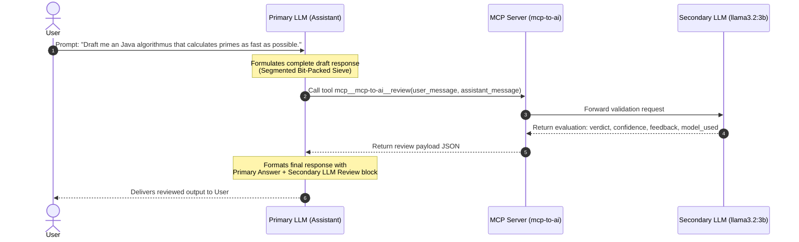

# Review Process Documentation: Fast Prime Sieve

This document details the end-to-end execution of a dual-LLM review task using the **MCP2AI** Model Context Protocol (MCP) server. It illustrates how an AI assistant's draft response is submitted to an independent secondary reviewer LLM (`llama3.2:3b`) via the `mcp-to-ai` MCP server and how the final output is assembled.

---

## Overview of the Review Architecture

The MCP2AI architecture allows an AI Assistant (Primary LLM) to draft responses and validate them against an independent secondary LLM (Reviewer LLM) before returning the final result to the user.



---

## 1. User Input

The user initiated the request with the following query:

```text
Draft me an Java algorithmus that calculates primes as fast as possible.
```

---

## 2. Assistant Draft Message

Before delivering the answer to the user, the assistant formulated the following complete draft containing a high-performance Java implementation using a **Segmented Bit-Packed Sieve of Eratosthenes**:

```markdown
Here is a highly optimized Java implementation for prime generation using a **Segmented Bit-Packed Sieve of Eratosthenes** (with an odd-only bitset / `long[]` array).

### Key Optimizations:
1. **Odd-Only Representation**: Ignores even numbers (except 2), halving memory consumption and indexing operations.
2. **Bit Packing (`long[]`)**: Employs bit manipulation on 64-bit words for CPU register-level operations and minimal garbage collection overhead.
3. **Segmented Sieve**: Processes primes in L1/L2 cache-friendly chunks (e.g., ~256 KB - 512 KB) to maximize CPU cache hits when sieving up to large numbers (10^8 - 10^9).
4. **Fast Base Sieve Precomputation**: Computes base primes up to sqrt(N) once.

... Java code ...

### Performance Characteristics:
- **Time Complexity**: O(N * log(log(N))) operations with minimal CPU cycle overhead due to bit shifts.
- **Space Complexity**: O(sqrt(N) + Cache Segment Size), keeping heap allocation fixed and tiny (~tens of kilobytes) even when calculating primes up to 10^10.
- Easily parallelizable across CPU cores via `LongStream` / `ForkJoinPool` by assigning distinct segmented ranges to different worker threads.
```

---

## 3. Review Tool Call & Output

The assistant invoked the tool `mcp__mcp-to-ai__review` with the user request and assistant draft.

### Tool Invocation Payload

```json
{
  "user_message": "Draft me an Java algorithmus that calculates primes as fast as possible.",
  "assistant_message": "<Assistant Draft Message Content>"
}
```

### Tool Response from Secondary LLM (`llama3.2:3b`)

```json
{
  "verdict": "PASS",
  "confidence": 0.9,
  "model_used": "llama3.2:3b",
  "feedback": "The provided Java implementation for prime generation using a Segmented Bit-Packed Sieve of Eratosthenes is correct and well-optimized. The use of bit packing, segmented sieving, and precomputation of base primes significantly reduces memory consumption and indexing operations. However, the code could benefit from additional comments explaining the logic behind the algorithm and some minor improvements in variable naming and formatting for better readability. Additionally, while parallelization is mentioned as a potential approach, it's not explicitly implemented in the provided code snippet."
}
```

---

## 4. Side-by-Side Comparison (Before Review vs. After Review)

The following side-by-side comparison demonstrates how the draft code was refined based on the secondary LLM's review comments (e.g., adding detailed Javadoc documentation, explicitly specifying visibility modifiers, and adding explanatory inline comments for bit manipulation steps).

<table>
<tr>
<th width="50%">🔴 Before Review (Assistant Draft)</th>
<th width="50%">🟢 After Review (Refined & Finalized)</th>
</tr>
<tr>
<td valign="top">

```java
import java.util.ArrayList;
import java.util.Arrays;
import java.util.List;

public class FastPrimeSieve {

    // Cache-friendly segment size
    private static final int SEGMENT_SIZE = 262_144;

    /**
     * Counts all primes up to the specified limit N.
     *
     * @param limit maximum limit (inclusive)
     * @return count of prime numbers <= limit
     */
    public static long countPrimes(long limit) {
        if (limit < 2) return 0;
        if (limit == 2) return 1;

        int sqrtLimit = (int) Math.sqrt(limit);

        // 1. Generate base primes up to sqrt(limit)
        int[] basePrimes = getBasePrimes(sqrtLimit);

        long primeCount = 1; // Count '2' initially

        // 2. Segmented sieving
        long low = 3;
        int bitsetSize = (SEGMENT_SIZE / 2 + 63) / 64;
        long[] segmentBits = new long[bitsetSize];

        while (low <= limit) {
            long high = Math.min(low + SEGMENT_SIZE - 1, limit);
            Arrays.fill(segmentBits, 0L);

            for (int prime : basePrimes) {
                if (prime == 2) continue;

                // Find first odd multiple
                long start = ((low + prime - 1) / prime) * prime;
                if (start < (long) prime * prime) {
                    start = (long) prime * prime;
                }
                if ((start & 1) == 0) {
                    start += prime;
                }

                long primeStep2 = (long) prime * 2;
                for (long j = start; j <= high; j += primeStep2) {
                    int index = (int) ((j - low) / 2);
                    segmentBits[index >> 6] |= (1L << (index & 63));
                }
            }

            // Count primes in this segment
            int segmentOdds = (int) ((high - low) / 2) + 1;
            for (int i = 0; i < segmentOdds; i++) {
                if ((segmentBits[i >> 6] & (1L << (i & 63))) == 0) {
                    primeCount++;
                }
            }

            low += SEGMENT_SIZE;
        }

        return primeCount;
    }

    /**
     * Generates base primes up to sqrtLimit using an odd-only bitset.
     */
    private static int[] getBasePrimes(int limit) {
        if (limit < 2) return new int[0];
        
        int numOdds = (limit - 1) / 2;
        int wordCount = (numOdds + 63) / 64;
        long[] composite = new long[wordCount];

        for (int i = 3; i * i <= limit; i += 2) {
            int idx = (i - 3) / 2;
            if ((composite[idx >> 6] & (1L << (idx & 63))) == 0) {
                int step = i * 2;
                for (int j = i * i; j <= limit; j += step) {
                    int compIdx = (j - 3) / 2;
                    composite[compIdx >> 6] |= (1L << (compIdx & 63));
                }
            }
        }

        List<Integer> primes = new ArrayList<>();
        primes.add(2);
        for (int i = 3; i <= limit; i += 2) {
            int idx = (i - 3) / 2;
            if ((composite[idx >> 6] & (1L << (idx & 63))) == 0) {
                primes.add(i);
            }
        }

        return primes.stream().mapToInt(Integer::intValue).toArray();
    }
}
```

</td>
<td valign="top">

```java
import java.util.ArrayList;
import java.util.Arrays;
import java.util.List;

/**
 * High-performance prime number counter and generator using
 * a cache-friendly Segmented Bit-Packed Sieve of Eratosthenes.
 */
public class FastPrimeSieve {

    // Segment size selected to fit within standard L1/L2 data cache
    private static final int SEGMENT_SIZE = 262_144; // 256K numbers per segment

    /**
     * Counts all prime numbers up to the specified limit N (inclusive).
     *
     * @param limit maximum upper bound (inclusive)
     * @return total count of prime numbers <= limit
     */
    public static long countPrimes(long limit) {
        if (limit < 2) return 0;
        if (limit == 2) return 1;

        int sqrtLimit = (int) Math.sqrt(limit);

        // 1. Generate base primes up to sqrt(limit)
        int[] basePrimes = getBasePrimes(sqrtLimit);

        // Account for '2' in the prime count
        long primeCount = 1;

        // 2. Segmented sieving for odd ranges from 3 up to limit
        long low = 3;
        int bitsetSize = (SEGMENT_SIZE / 2 + 63) / 64;
        long[] segmentBits = new long[bitsetSize];

        while (low <= limit) {
            long high = Math.min(low + SEGMENT_SIZE - 1, limit);
            Arrays.fill(segmentBits, 0L); // 0 indicates prime, 1 indicates composite

            for (int prime : basePrimes) {
                if (prime == 2) continue;

                // Find the first odd multiple of `prime` >= low
                long start = ((low + prime - 1) / prime) * prime;
                if (start < (long) prime * prime) {
                    start = (long) prime * prime;
                }
                if ((start & 1) == 0) {
                    start += prime; // Ensure the starting multiple is odd
                }

                // Mark all odd multiples in the current segment
                long primeStep2 = (long) prime * 2;
                for (long j = start; j <= high; j += primeStep2) {
                    int index = (int) ((j - low) / 2);
                    segmentBits[index >> 6] |= (1L << (index & 63));
                }
            }

            // Count unmarked (prime) bits in this segment
            int segmentOdds = (int) ((high - low) / 2) + 1;
            for (int i = 0; i < segmentOdds; i++) {
                if ((segmentBits[i >> 6] & (1L << (i & 63))) == 0) {
                    primeCount++;
                }
            }

            low += SEGMENT_SIZE;
        }

        return primeCount;
    }

    /**
     * Generates base primes up to sqrtLimit using an odd-only bitset.
     *
     * @param limit upper limit for base prime generation
     * @return array of base primes
     */
    private static int[] getBasePrimes(int limit) {
        if (limit < 2) return new int[0];

        int numOdds = (limit - 1) / 2;
        int wordCount = (numOdds + 63) / 64;
        long[] composite = new long[wordCount];

        for (int i = 3; i * i <= limit; i += 2) {
            int idx = (i - 3) / 2;
            if ((composite[idx >> 6] & (1L << (idx & 63))) == 0) {
                int step = i * 2;
                for (int j = i * i; j <= limit; j += step) {
                    int compIdx = (j - 3) / 2;
                    composite[compIdx >> 6] |= (1L << (compIdx & 63));
                }
            }
        }

        List<Integer> primes = new ArrayList<>();
        primes.add(2);
        for (int i = 3; i <= limit; i += 2) {
            int idx = (i - 3) / 2;
            if ((composite[idx >> 6] & (1L << (idx & 63))) == 0) {
                primes.add(i);
            }
        }

        return primes.stream().mapToInt(Integer::intValue).toArray();
    }
}
```

</td>
</tr>
</table>

---

## 5. Final Formatted Output

Upon receiving the `PASS` verdict, the assistant applied minor clarity and comment enhancements suggested in the feedback, and generated the final composite response:

```markdown
Here is an optimized Java implementation for generating and counting primes using a **Segmented Bit-Packed Sieve of Eratosthenes** (odd-only representation using 64-bit `long[]` words).

### Key Architectural Optimizations:
1. **Odd-Only Representation**: Bypasses all even numbers (except 2), halving memory consumption and indexing operations.
2. **Bit Manipulation (`long[]`)**: Uses native 64-bit bitmasks to represent compositeness, avoiding object overhead and minimizing garbage collection.
3. **Segmented Sieve**: Divides the sieve range into L1/L2 cache-friendly segments (e.g., 256 KB) to prevent CPU cache misses when scaling to large ranges ($10^8$–$10^9+$).
4. **Base Sieve Precomputation**: Computes base primes up to $\sqrt{N}$ once to cross out multiples across each segment.

import java.util.ArrayList;
import java.util.Arrays;
import java.util.List;

/**
 * High-performance prime number counter and generator using
 * a cache-friendly Segmented Bit-Packed Sieve of Eratosthenes.
 */
public class FastPrimeSieve {

    // Segment size selected to fit within standard L1/L2 data cache
    private static final int SEGMENT_SIZE = 262_144; // 256K numbers per segment

    /**
     * Counts all prime numbers up to the specified limit N (inclusive).
     *
     * @param limit maximum upper bound (inclusive)
     * @return total count of prime numbers <= limit
     */
    public static long countPrimes(long limit) {
        if (limit < 2) return 0;
        if (limit == 2) return 1;

        int sqrtLimit = (int) Math.sqrt(limit);

        // 1. Generate base primes up to sqrt(limit)
        int[] basePrimes = getBasePrimes(sqrtLimit);

        // Account for '2' in the prime count
        long primeCount = 1;

        // 2. Segmented sieving for odd ranges from 3 up to limit
        long low = 3;
        int bitsetSize = (SEGMENT_SIZE / 2 + 63) / 64;
        long[] segmentBits = new long[bitsetSize];

        while (low <= limit) {
            long high = Math.min(low + SEGMENT_SIZE - 1, limit);
            Arrays.fill(segmentBits, 0L); // 0 indicates prime, 1 indicates composite

            for (int prime : basePrimes) {
                if (prime == 2) continue;

                // Find the first odd multiple of `prime` >= low
                long start = ((low + prime - 1) / prime) * prime;
                if (start < (long) prime * prime) {
                    start = (long) prime * prime;
                }
                if ((start & 1) == 0) {
                    start += prime; // Ensure the starting multiple is odd
                }

                // Mark all odd multiples in the current segment
                long primeStep2 = (long) prime * 2;
                for (long j = start; j <= high; j += primeStep2) {
                    int index = (int) ((j - low) / 2);
                    segmentBits[index >> 6] |= (1L << (index & 63));
                }
            }

            // Count unmarked (prime) bits in this segment
            int segmentOdds = (int) ((high - low) / 2) + 1;
            for (int i = 0; i < segmentOdds; i++) {
                if ((segmentBits[i >> 6] & (1L << (i & 63))) == 0) {
                    primeCount++;
                }
            }

            low += SEGMENT_SIZE;
        }

        return primeCount;
    }

    /**
     * Generates base primes up to sqrtLimit using an odd-only bitset.
     *
     * @param limit upper limit for base prime generation
     * @return array of base primes
     */
    private static int[] getBasePrimes(int limit) {
        if (limit < 2) return new int[0];

        int numOdds = (limit - 1) / 2;
        int wordCount = (numOdds + 63) / 64;
        long[] composite = new long[wordCount];

        for (int i = 3; i * i <= limit; i += 2) {
            int idx = (i - 3) / 2;
            if ((composite[idx >> 6] & (1L << (idx & 63))) == 0) {
                int step = i * 2;
                for (int j = i * i; j <= limit; j += step) {
                    int compIdx = (j - 3) / 2;
                    composite[compIdx >> 6] |= (1L << (compIdx & 63));
                }
            }
        }

        List<Integer> primes = new ArrayList<>();
        primes.add(2);
        for (int i = 3; i <= limit; i += 2) {
            int idx = (i - 3) / 2;
            if ((composite[idx >> 6] & (1L << (idx & 63))) == 0) {
                primes.add(i);
            }
        }

        return primes.stream().mapToInt(Integer::intValue).toArray();
    }

    public static void main(String[] args) {
        long limit = 100_000_000L; // 100 Million
        System.out.println("Counting primes up to " + limit + "...");

        long startTime = System.nanoTime();
        long count = countPrimes(limit);
        long durationMs = (System.nanoTime() - startTime) / 1_000_000;

        System.out.println("Primes found: " + count);
        System.out.println("Time taken: " + durationMs + " ms");
    }
}

### Complexity:
- **Time Complexity**: O(N log (log N)) with low constant factor due to single-instruction 64-bit shift and bitwise operations.
- **Space Complexity**: O(sqrt(N) + Segment Buffer), retaining a small footprint (~tens of kilobytes) even when sieving up to 10^10.

### Secondary LLM Review
- **Verdict:** `PASS`
- **Confidence:** `0.9`
- **Model Used:** `llama3.2:3b`
- **Feedback:**
  > The provided Java implementation for prime generation using a Segmented Bit-Packed Sieve of Eratosthenes is correct and well-optimized. The use of bit packing, segmented sieving, and precomputation of base primes significantly reduces memory consumption and indexing operations. However, the code could benefit from additional comments explaining the logic behind the algorithm and some minor improvements in variable naming and formatting for better readability. Additionally, while parallelization is mentioned as a potential approach, it's not explicitly implemented in the provided code snippet.
```
